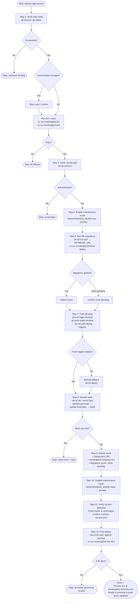

# Preview Deploy Flow

Triggered by `/deploy-app preview`. Deploys `develop` to `mockingbird.chrisstoy.com`.

```mermaid
flowchart TD
    A([Start: /deploy-app preview]) --> B

    B["Step 2: Verify repo state\ngit branch / git status"]
    B --> B1{On develop?}
    B1 -- No --> STOP1([Stop: checkout develop])
    B1 -- Yes --> B2{Uncommitted changes?}
    B2 -- Yes --> B3[Warn user / confirm]
    B3 --> B4
    B2 -- No --> B4["Run lint + tests\nnx run mockingbird:lint\nnx run mockingbird:test"]
    B4 --> B5{Pass?}
    B5 -- No --> STOP2([Stop: fix failures])
    B5 -- Yes --> C

    C["Step 3: Verify Vercel auth\nvercel whoami"]
    C --> C1{Authenticated?}
    C1 -- No --> STOP3([Stop: vercel login])
    C1 -- Yes --> E

    E["Step 5: Enable maintenance mode\nMAINTENANCE_MODE=true → preview"]
    E --> F

    F["Step 6: Run DB migrations\nvercel env pull → DATABASE_URL\nnx run mockingbird:prisma-deploy"]
    F --> F1{Migrations applied?}
    F1 -- Yes --> F2[Report count]
    F1 -- None pending --> F3[Confirm none pending]
    F2 --> G
    F3 --> G

    G["Step 7: Push develop\ngit pull origin develop\ngit push origin develop\n→ Vercel auto-deploy triggers"]
    G --> G1{Push triggers deploy?}
    G1 -- No --> G2["Manual fallback\nvercel deploy"]
    G1 -- Yes --> H
    G2 --> H

    H["Step 8: Monitor build\nvercel list / vercel logs\n(prisma-generate → update-build-date → build)"]
    H --> H1{Build success?}
    H1 -- No --> STOP4([Stop: report error + step])
    H1 -- Yes --> I

    I["Step 9: Report result\n• Deployment URL\n• mockingbird.chrisstoy.com\n• Migrations count / none pending"]
    I --> J

    J["Step 10: Disable maintenance mode\nMAINTENANCE_MODE=false → preview"]
    J --> K

    K["Step 11: Verify version deployed\nCheck footer at /auth/signin\nConfirm matches version.json"]
    K --> L

    L["Step 12: Post-deploy\nRun E2E tests against preview\nnx run mockingbird-e2e:e2e"]
    L --> L1{E2E pass?}
    L1 -- No --> STOP5([Stop: fix before promoting to prod])
    L1 -- Yes --> DONE

    DONE([Done ✓\nPreview live at mockingbird.chrisstoy.com\nReady to promote to prod when validated])
```
