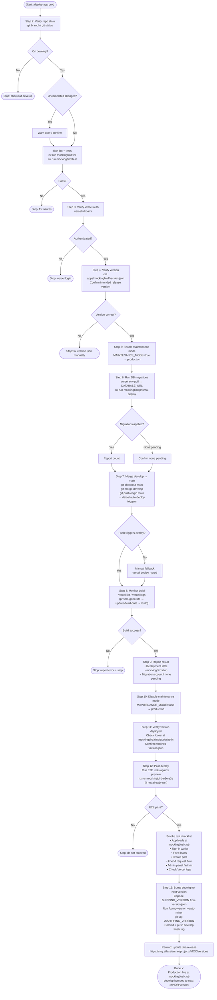

# Production Deploy Flow

Triggered by `/deploy-app prod`. Merges `develop → main`, deploys to `mockingbird.club`.

> E2E tests on preview must pass before starting this flow.

```mermaid
flowchart TD
    A([Start: /deploy-app prod]) --> B

    B["Step 2: Verify repo state\ngit branch / git status"]
    B --> B1{On develop?}
    B1 -- No --> STOP1([Stop: checkout develop])
    B1 -- Yes --> B2{Uncommitted changes?}
    B2 -- Yes --> B3[Warn user / confirm]
    B3 --> B4
    B2 -- No --> B4["Run lint + tests\nnx run mockingbird:lint\nnx run mockingbird:test"]
    B4 --> B5{Pass?}
    B5 -- No --> STOP2([Stop: fix failures])
    B5 -- Yes --> C

    C["Step 3: Verify Vercel auth\nvercel whoami"]
    C --> C1{Authenticated?}
    C1 -- No --> STOP3([Stop: vercel login])
    C1 -- Yes --> D

    D["Step 4: Verify version\ncat apps/mockingbird/version.json\nConfirm intended release version"]
    D --> D1{Version correct?}
    D1 -- No --> STOP4([Stop: fix version.json manually])
    D1 -- Yes --> E

    E["Step 5: Enable maintenance mode\nMAINTENANCE_MODE=true → production"]
    E --> F

    F["Step 6: Run DB migrations\nvercel env pull → DATABASE_URL\nnx run mockingbird:prisma-deploy"]
    F --> F1{Migrations applied?}
    F1 -- Yes --> F2[Report count]
    F1 -- None pending --> F3[Confirm none pending]
    F2 --> G
    F3 --> G

    G["Step 7: Merge develop → main\ngit checkout main\ngit merge develop\ngit push origin main\n→ Vercel auto-deploy triggers"]
    G --> G1{Push triggers deploy?}
    G1 -- No --> G2["Manual fallback\nvercel deploy --prod"]
    G1 -- Yes --> H
    G2 --> H

    H["Step 8: Monitor build\nvercel list / vercel logs\n(prisma-generate → update-build-date → build)"]
    H --> H1{Build success?}
    H1 -- No --> STOP5([Stop: report error + step])
    H1 -- Yes --> I

    I["Step 9: Report result\n• Deployment URL\n• mockingbird.club\n• Migrations count / none pending"]
    I --> J

    J["Step 10: Disable maintenance mode\nMAINTENANCE_MODE=false → production"]
    J --> K

    K["Step 11: Verify version deployed\nCheck footer at mockingbird.club/auth/signin\nConfirm matches version.json"]
    K --> L

    L["Step 12: Post-deploy\nRun E2E tests against preview\nnx run mockingbird-e2e:e2e\n(if not already run)"]
    L --> L1{E2E pass?}
    L1 -- No --> STOP6([Stop: do not proceed])
    L1 -- Yes --> L2["Smoke test checklist\n• App loads at mockingbird.club\n• Sign-in works\n• Feed loads\n• Create post\n• Friend request flow\n• Admin panel /admin\n• Check Vercel logs"]
    L2 --> M

    M["Step 13: Bump develop to next version\nCapture SHIPPING_VERSION from version.json\nRun /bump-version --auto-minor\ngit tag v$SHIPPING_VERSION\nCommit + push develop\nPush tag"]
    M --> M1[Remind: update Jira release\nhttps://stoy.atlassian.net/projects/MOC/versions]
    M1 --> DONE

    DONE([Done ✓\nProduction live at mockingbird.club\ndevelop bumped to next MINOR version])
```
